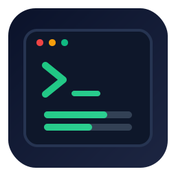
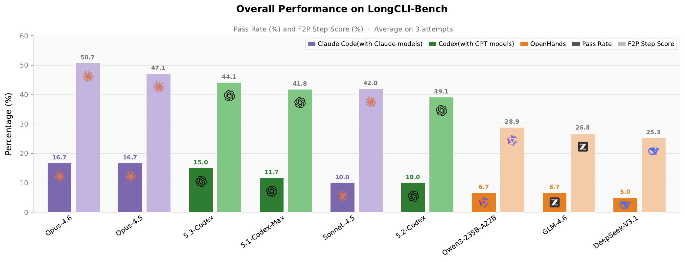
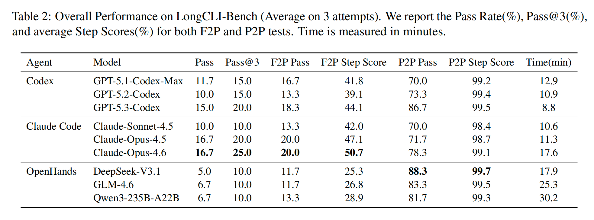
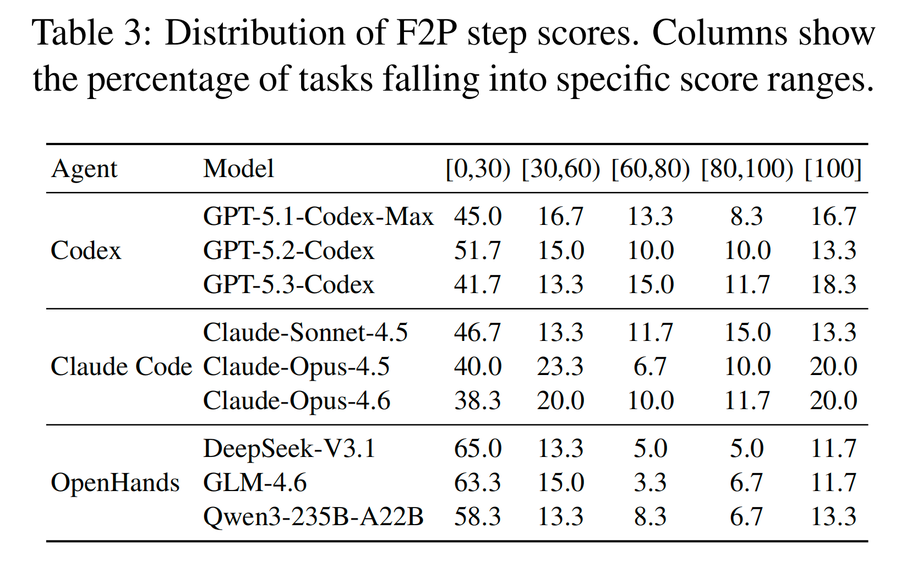

<p align="center">
  
</p>

<h1 align="center">LongCLI-Bench</h1>

<p align="center"><i>A Preliminary Benchmark and Study for Long-horizon Agentic Programming in Command-Line Interfaces</i></p>

<p align="center">
  <a href="https://arxiv.org/abs/2602.14337"></a>
  
  
  
</p>

<p align="center">
  <a href="#abstract">Abstract</a> |
  <a href="#results">Results</a> |
  <a href="#quick-start">Quick Start</a> |
  <a href="#framework-extensions-over-terminal-bench">Extensions</a> |
  <a href="#task-taxonomy-and-evaluation-metrics">Metrics</a> |
  <a href="#citation">Citation</a>
</p>

## Abstract

> Recent advances in AI-assisted programming have empowered agents to execute complex workflows via command-line interfaces. However, existing benchmarks are limited by short task horizons, data contamination from GitHub scraping, and a lack of fine-grained evaluation metrics, which makes it difficult to rigorously evaluate long-horizon planning and execution. To address these gaps, we introduce **LongCLI-Bench**, a benchmark designed to evaluate agentic capabilities across realistic long-horizon tasks. We curated 20 high-quality tasks from over 1,000 computer science assignments and real-world workflows, covering four engineering categories: from scratch, feature addition, bug fixing, and refactoring. We propose a dual-set testing protocol that measures requirement fulfillment *(fail->pass)* and regression avoidance *(pass->pass)*, with step-level scoring to pinpoint execution failures. Experiments show that even state-of-the-art agents achieve pass rates below 20% on LongCLI-Bench, and most tasks stall at less than 30% completion. While self-correction yields marginal gains, human-agent collaboration through plan injection and interactive guidance offers significantly larger improvements.

## Results

<p align="center">
  
</p>

<p align="center">
  
</p>

<p align="center">
  
</p>

## Quick Start

### Requirements

- Docker
- Python `>=3.12`
- `uv`

### 1. Installation

```bash
cd longcli-bench
uv run pip install -e .
```

### 2. Build Base Images

```bash
cd longcli_dockerImage
docker build -f Dockerfile.make-pytest-base -t tb/make-pytest:v0 .
docker build -f Dockerfile.c-env-base -t tb/c-env:v0 .
```

### 3. Smoke Check

```bash
tb run --help
uv run tb tasks interact -t pytest_pytest_example --tasks-dir tasks_long_cli_example --include-all
```

If you can enter the interactive container successfully, the CLI, Docker Compose, and base-image workflow are set up correctly.

### 4. Run a Single Task

```bash
LLM_BASE_URL="<base_url>" LLM_API_KEY="<api_key>" \
tb run \
  --agent <agent_name> \
  --model <model_name> \
  --task-id <task_id> \
  --dataset-path <dataset_path> \
  --run-id <output_dir> \
  --n-attempts N \
  --give-test-output M
```

Common flags:

- `--agent`: e.g., `codex`, `cursor_cli`, `grok_cli`, `terminus_2`
- `--model`: e.g., `gpt-5`
- `--dataset-path`: task directory, e.g., `tasks_long_cli`
- `--run-id`: output run name (stored under `runs/<run-id>` by default)
- `--n-attempts`: number of independent attempts (used for pass@k)
- `--give-test-output`: number of self-correction turns within each attempt

### 5. Batch Run (Basic Example)

```bash
LLM_BASE_URL="<base_url>" LLM_API_KEY="<api_key>" \
python scripts_python/longcli_run_batch.py \
  --agent-model-pair codex,gpt-5.1-codex-max \
  --task-id 61810_cow \
  --tasks-dir tasks_long_cli \
  --output-path runs_long_cli \
  --exp-setting 1,3 \
  --on-existing skip
```

### 6. Batch Run (Script Defaults)

Modify parameters in `scripts_python/longcli_run_batch.py`, then run:

```bash
python scripts_python/longcli_run_batch.py
```

## Framework Extensions over Terminal-Bench

1. Fine-grained scoring with task-level `is_pass` and step-level `step_score`.
2. Dual test sets: `Fail->Pass (F2P)` and `Pass->Pass (P2P)`.
3. Two parsing modes for test results: native `pytest` parsing and text-based parsing (custom score text).
4. Environment variable `TB_SAVE_APP_RESULT`: whether to save `/app` from inside the container to the output directory (`1/0`).
5. Environment variable `TB_SKIP_AGENT`: whether to skip agent execution (`1/0`, useful for task/script debugging).
6. Multi-attempt evaluation via `--n-attempts N`, including `pass@k` statistics.
7. Multi-turn self-correction within each attempt via `--give-test-output M`.

## Task Taxonomy and Evaluation Metrics

### Taxonomy by Engineering Capability

1. `from_scratch (0 -> 1)`: build a project from scratch.
2. `feature_add (N -> N+1)`: add new functionality to an existing repository.
3. `bug_fix (No -> Yes)`: locate and fix complex bugs.
4. `project_refactor (A -> A')`: optimize/refactor code without changing external behavior.

### Test Sets and Metrics

Test sets:

- `F2P (Fail->Pass)`: whether new requirements are correctly implemented.
- `P2P (Pass->Pass)`: whether existing functionality remains intact (regression check).

Core metrics:

- `is_pass`: binary task-level success/failure.
- `step_score`: step-level completion percentage.
- `time`: execution time.
- `token cost`: token usage.

Common reporting strategies:

- `pass@1`, `pass@3`
- Multi-turn self-correction using test feedback

## Citation

```bibtex
@misc{feng2026longclibenchpreliminarybenchmarkstudy,
  title={LongCLI-Bench: A Preliminary Benchmark and Study for Long-horizon Agentic Programming in Command-Line Interfaces},
  author={Yukang Feng and Jianwen Sun and Zelai Yang and Jiaxin Ai and Chuanhao Li and Zizhen Li and Fanrui Zhang and Kang He and Rui Ma and Jifan Lin and Jie Sun and Yang Xiao and Sizhuo Zhou and Wenxiao Wu and Yiming Liu and Pengfei Liu and Yu Qiao and Shenglin Zhang and Kaipeng Zhang},
  year={2026},
  eprint={2602.14337},
  archivePrefix={arXiv},
  primaryClass={cs.SE},
  url={https://arxiv.org/abs/2602.14337},
}
```

## Acknowledgement

This project is built on and extends [terminal-bench](https://github.com/laude-institute/terminal-bench).
LongCLI-Bench is a derivative work with task, data, and evaluation extensions for long-horizon CLI agent benchmarking.

## License

This repository is licensed under Apache-2.0.
Some task folders may include third-party components under their own licenses; see the corresponding subdirectory `LICENSE` files.
