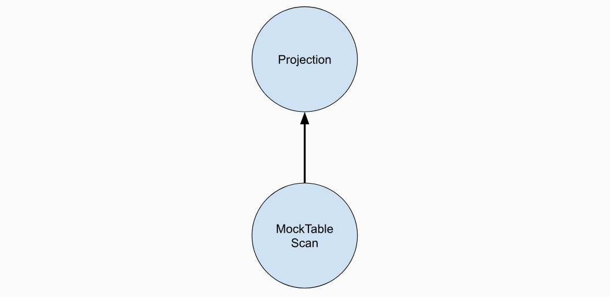
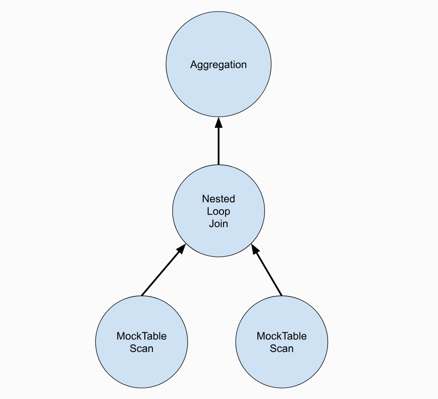

# Overview

At this point in the semester, you have implemented many internal components of a database management system.In [Project #1](https://15445.courses.cs.cmu.edu/spring2023/project1), you implemented a buffer pool manager. In [Project #2](https://15445.courses.cs.cmu.edu/spring2023/project2), you implemented a B+tree index. In this project, you will implement the components that allow BusTub to execute queries. You will create the operator executors that execute SQL queries and implement optimizer rules to transform query plans.

This project is composed of several tasks:

- [**Task #1: Access Method Executors**](https://15445.courses.cs.cmu.edu/spring2023/project3/#task1)
- [**Task #2: Aggregation and Join Executors**](https://15445.courses.cs.cmu.edu/spring2023/project3/#task2)
- [**Task #3: Sort + Limit Executors and Top-N Optimization**](https://15445.courses.cs.cmu.edu/spring2023/project3/#task3)
- [**Optional Leaderboard Tasks**](https://15445.courses.cs.cmu.edu/spring2023/project3/#leaderboard)

This project must be completed individually (i.e., no groups). Before starting, run `git pull public master` to pull the latest code from the public [BusTub repo](https://github.com/cmu-db/bustub).

# Background: Query Processing

Please read this section carefully because you will need to construct your own SQL queries to test your executor implementation.

BusTub's architecture is as follows:


```
cd build && make -j$(nproc) shell
./bin/bustub-shell
```

You can also use [BusTub Web Shell](https://15445.courses.cs.cmu.edu/spring2023/bustub/) to run the examples below. It is a complete reference solution of the system running in your browser!

Within the shell, you can use `\dt` to view all tables. By default, the BusTub shell will automatically create three tables that are pre-populated with data. This is provided as a convenience so that you do not need to load data every time you rebuild your solution. Changes to these tables will not be persisted when you restart the DBMS.

```
bustub> \dt
+-----+----------------+------------------------------+
| oid | name | cols |
+-----+----------------+------------------------------+
| 0 | __mock_table_1 | (colA:INTEGER, colB:INTEGER) |
| 1 | __mock_table_2 | (colC:VARCHAR, colD:VARCHAR) |
| 2 | __mock_table_3 | (colE:INTEGER, colF:VARCHAR) |
| ... | ... | ... |
+-----+----------------+------------------------------+
```

You can view all data from a table by using the `SELECT` statement:

```
bustub> SELECT * FROM __mock_table_1;
+---------------------+---------------------+
| __mock_table_1.colA | __mock_table_1.colB |
+---------------------+---------------------+
| 0 | 0 |
| 1 | 100 |
| 2 | 200 |
| 3 | 300 |
| 4 | 400 |
| 5 | 500 |
| ... | ... |
+---------------------+---------------------+
```

Please note:

- BusTub only supports a small subset of SQL. Don't be surprised if it does not work with some SQL queries. For all SQL queries supported in BusTub, refer to the SQLLogicTest files in `tests/sql`.
- If you are using CLion to run the BusTub shell, please add a `--disable-tty` parameter to the shell, so that it works correctly in the CLion terminal.
- Always end your statement with `;` (except internal commands).
- BusTub only supports `INT` and `VARCHAR(n)` type. Also you should use single quotes for strings, e.g., `INSERT INTO table VALUES ('a')`.

## Inspecting SQL query plans

BusTub supports the `EXPLAIN` command to print a query's execution plan. You can add `EXPLAIN` in front of any query. For example:

```
bustub> EXPLAIN SELECT * FROM __mock_table_1;
=== BINDER ===
BoundSelect {
 table=BoundBaseTableRef { table=__mock_table_1, oid=0 },
 columns=[__mock_table_1.colA, __mock_table_1.colB],
 groupBy=[],
 having=,
 where=,
 limit=,
 offset=,
 order_by=[],
 is_distinct=false,
}
=== PLANNER ===
Projection { exprs=[#0.0, #0.1] } | (__mock_table_1.colA:INTEGER, __mock_table_1.colB:INTEGER)
MockScan { table=__mock_table_1 } | (__mock_table_1.colA:INTEGER, __mock_table_1.colB:INTEGER)
=== OPTIMIZER ===
MockScan { table=__mock_table_1 } | (__mock_table_1.colA:INTEGER, __mock_table_1.colB:INTEGER)
```

The result of `EXPLAIN` provides an overview of the transformation process within the query processing layer. The statement is first processed by the parser and the binder, which produces an abstract syntax tree (AST) representing the query. In this example, the query is represented by a `BoundSelect` on `__mock_table_1` that will retrieve two columns (`colA` and `colB`). Note that the binder automatically expands the `*`character from the original SQL query into the actual columns in the table.

Next, the binder AST is processed by the planner, which will produce an appropriate query plan. In this case, the query plan is a tree of two nodes, with data flowing from the leaves to the root:



After that, the optimizer will optimize the query plan. In this case, it removes the projection because it is redundant.

Let's consider a more complex example:

```
bustub> EXPLAIN (o) SELECT colA, MAX(colB) FROM
 (SELECT * FROM __mock_table_1, __mock_table_3 WHERE colA = colE) GROUP BY colA;
=== OPTIMIZER ===
Agg { types=[max], aggregates=[#0.1], group_by=[#0.0] }
 NestedLoopJoin { type=Inner, predicate=(#0.0=#1.0) }
 MockScan { table=__mock_table_1 }
 MockScan { table=__mock_table_3 }
```

For this example, the optimized query plan is:



In this project, you will need to construct SQL queries to test each of your executor's implementations. `EXPLAIN` is extremely helpful for you to know if a SQL query is using a specific executor.

## Sample executors

In the BusTub public repository, we provide several sample executor implementations.

```markdown
### Projection

A **projection** node can represent various computations on its input. It will always have exactly one child node. In the BusTub shell, inspect the query plans for the following queries:

EXPLAIN SELECT 1 + 2;
EXPLAIN SELECT colA FROM __mock_table_1;
EXPLAIN SELECT colA + colB AS a, 1 + 2 AS b FROM __mock_table_1;

A projection plan node consists of one or more expressions representing a computation:

- `ColumnValueExpression`: directly places a column of the child executor to the output. The syntax `#0.0` means the first column in the first child. You will see something like `#0.0 = #1.0` in a plan for joins.
- `ConstantExpression`: represents a constant value (e.g., `1`).
- `ArithmeticExpression`: a tree representing an arithmetic computation. For example, `1 + 2` would be represented by an `ArithmeticExpression` with two `ConstantExpression` (`1` and `2`) as children.
```

```markdown
Filter

A **filter** plan node is used to filter the output of a child given a predicate. For example:

EXPLAIN SELECT * FROM __mock_table_1 WHERE colA > 1;

A filter node has exactly one child and contains a predicate.
```

```markdown
 ### Values

A **values** plan node is used to directly produce values:

EXPLAIN values (1, 2, 'a'), (3, 4, 'b');
CREATE TABLE table1(v1 INT, v2 INT, v3 VARCHAR(128));
EXPLAIN INSERT INTO table1 VALUES (1, 2, 'a'), (3, 4, 'b');

Values plan nodes are useful when inserting user-supplied values into a table.
```

## The schema of a query plan

As you might have noticed, `EXPLAIN` produces a string of column descriptions after each plan node. That's the output schema of the node. Consider this example output:

```
Projection { exprs=[#0.0, #0.1] } | (__mock_table_1.colA:INTEGER, __mock_table_1.colB:INTEGER)
```

This indicates that the executor representing this plan node will produce two columns, both of integer types. The output schema is inferred within the planner. For this project, your executor implementations must produce tuples with schema exactly as specified in the plan node, or they will fail our unit tests.

# Project Specification

In this project, you will add new operator executors and query optimizations to BusTub. BusTub uses the iterator (i.e., Volcano) query processing model, in which every executor implements a `Next` function to get the next tuple result. When the DBMS invokes an executor's `Next` function, the executor returns either (1) a single tuple or (2) an indicator that there are no more tuples. With this approach, each executor implements a loop that continues calling `Next` on its children to retrieve tuples and process them one by one.

In BusTub's implementation of the iterator model, the `Next` function for each executor returns a record identifier (`RID`) in addition to a tuple. A record identifier serves as a unique identifier for the tuple.

The executors are created from an execution plan in [executor_factory.cpp](https://github.com/cmu-db/bustub/blob/master/src/execution/executor_factory.cpp).

All test cases in this project are written in a special file format called SQLLogicTest (derived from SQLite). You can find how to use it at the end of this page.

## Task #1 - Access Method Executors

In the background section above, we saw that the BusTub can already retrieve data from mock tables in `SELECT` queries. This is implemented without real tables by using a `MockScan` executor to always generate the same tuples using a predefined algorithm. This is why you cannot update these tables.

In this task, you will implement executors that read from and write to tables in the storage system. You will complete your implementation in the following files:

- src/include/execution/seq_scan_executor.h
- src/execution/seq_scan_executor.cpp
- src/include/execution/insert_executor.h
- src/execution/insert_executor.cpp
- src/include/execution/update_executor.h
- src/execution/update_executor.cpp
- src/include/execution/delete_executor.h
- src/execution/delete_executor.cpp
- src/include/execution/index_scan_executor.h
- src/execution/index_scan_executor.cpp

Each of these executors is described below.

```markdown
### SeqScan

The [`SeqScanPlanNode`](https://github.com/cmu-db/bustub/blob/master/src/include/execution/plans/seq_scan_plan.h) can be planned with a `SELECT * FROM table` statement.

bustub> CREATE TABLE t1(v1 INT, v2 VARCHAR(100));
Table created with id = 15
bustub> EXPLAIN (o,s) SELECT * FROM t1;
=== OPTIMIZER ===
SeqScan { table=t1 } | (t1.v1:INTEGER, t1.v2:VARCHAR)

The `SeqScanExecutor` iterates over a table and returns its tuples one at a time.

**Hint:** Make sure that you understand the difference between the pre-increment and post-increment operators when using the `TableIterator` object. You might get strange output if you confuse `++iter` with `iter++`. (Check [here](https://en.cppreference.com/w/cpp/language/operator_incdec) for a quick refresher.)

**Hint:** Do not emit tuples that are deleted in the `TableHeap`. Check the `is_deleted_` field of the corresponding [`TupleMeta`](https://github.com/cmu-db/bustub/blob/master/src/include/storage/table/tuple.h) for each tuple.

**Hint:** The output of sequential scan is a copy of each matched tuple and its original record identifier (`RID`).

**Note:** BusTub does not support `DROP TABLE` or `DROP INDEX`. You can reset your database by restarting the shell.
```

```markdown
### Insert

The [`InsertPlanNode`](https://github.com/cmu-db/bustub/blob/master/src/include/execution/plans/insert_plan.h) can be planned with a `INSERT` statement. Note that you will need to use a single quote to specify a `VARCHAR` value.

bustub> EXPLAIN (o,s) INSERT INTO t1 VALUES (1, 'a'), (2, 'b');
=== OPTIMIZER ===
Insert { table_oid=15 } | (__bustub_internal.insert_rows:INTEGER)
 Values { rows=2 } | (__values#0.0:INTEGER, __values#0.1:VARCHAR)

The `InsertExecutor` inserts tuples into a table and updates any affected indexes. It has exactly one child producing values to be inserted into the table. The planner will ensure that the values have the same schema as the table. The executor will produce a single tuple of integer type as the output, indicating how many rows have been inserted into the table. Remember to update indexes when inserting into the table, if there are indexes associated with it.

**Hint:** See the [System Catalog](https://15445.courses.cs.cmu.edu/spring2023/project3/#system-catalog) section below for information about the system catalog. To initialize this executor, you will need to look up information about the table being inserted into.

**Hint:** See the [Index Updates](https://15445.courses.cs.cmu.edu/spring2023/project3/#index-updates) section below for further details about updating a table's indexes.

**Hint:** You will need to use the [`TableHeap`](https://github.com/cmu-db/bustub/blob/master/src/include/storage/table/table_heap.h) class to perform table modifications.

**Hint:** You only need to change the `is_delete_` field when creating or modifying `TupleMeta`. For the `insertion_txn_` and the `deletion_txn_` fields, just set it to `INVALID_TXN_ID`. These fields are intended to be used in future semesters where we might switch to an MVCC storage.
```

```markdown
### Update

The [`UpdatePlanNode`](https://github.com/cmu-db/bustub/blob/master/src/include/execution/plans/update_plan.h) can be planned with an `UPDATE` statement. It has exactly one child with the records to be updated in the table.

bustub> explain (o,s) update test_1 set colB = 15445;
=== OPTIMIZER ===
Update { table_oid=20, target_exprs=[#0.0, 15445, #0.2, #0.3] } | (__bustub_internal.update_rows:INTEGER)
 SeqScan { table=test_1 } | (test_1.colA:INTEGER, test_1.colB:INTEGER, test_1.colC:INTEGER, test_1.colD:INTEGER)

The `UpdateExecutor` modifies existing tuples in a specified table. The executor will produce a single tuple of integer type as the output, indicating how many rows have been updated. Remember to update any indexes affected by the updates.

**Hint:** To implement an update, first delete the affected tuple and then insert a new tuple. Do not use the `TableHeap` `UpdateTupleInplaceUnsafe` function unless you are implementing leaderboard optimizations for project 4.
```

```markdown
### Delete

The [`DeletePlanNode`](https://github.com/cmu-db/bustub/blob/master/src/include/execution/plans/delete_plan.h) can be planned with a `DELETE` statement. It has exactly one child with the records to be deleted fromthe table. Your delete executor should produce an integer output that represents the number of rows that it deleted from the table. It will also need to update any affected indexes.

bustub> EXPLAIN (o,s) DELETE FROM t1;
=== OPTIMIZER ===
Delete { table_oid=15 } | (__bustub_internal.delete_rows:INTEGER)
 Filter { predicate=true } | (t1.v1:INTEGER, t1.v2:VARCHAR)
 SeqScan { table=t1 } | (t1.v1:INTEGER, t1.v2:VARCHAR)
bustub> EXPLAIN (o,s) DELETE FROM t1 where v1 = 1;
=== OPTIMIZER ===
Delete { table_oid=15 } | (__bustub_internal.delete_rows:INTEGER)
 Filter { predicate=#0.0=1 } | (t1.v1:INTEGER, t1.v2:VARCHAR)
 SeqScan { table=t1 } | (t1.v1:INTEGER, t1.v2:VARCHAR)

You may assume that the `DeleteExecutor` is always at the root of the query plan in which it appears. The `DeleteExecutor` should not modify its result set.

**Hint:** To delete a tuple, you need to get a `RID` from the child executor and update the `is_deleted_` field of the corresponding [`TupleMeta`](https://github.com/cmu-db/bustub/blob/master/src/include/storage/table/tuple.h) for that tuple. All deletes will be applied upon transaction commit.
```

```markdown
### IndexScan

The `IndexScanExecutor` iterates over an index to retrieve `RIDs` for tuples. The operator then uses these RIDs to retrieve their tuples in the corresponding table. It then emits these tuples one at a time.

You can test your index scan executor by `SELECT FROM <table> ORDER BY <index column>`. We will explain why `ORDER BY` can be transformed into `IndexScan` in [Task #3](https://15445.courses.cs.cmu.edu/spring2023/project3/#task3).
```

bustub> CREATE TABLE t2(v3 int, v4 int);
Table created with id = 16
bustub> CREATE INDEX t2v3 ON t2(v3);
Index created with id = 0
bustub> EXPLAIN (o,s) SELECT * FROM t2 ORDER BY v3;
=== OPTIMIZER ===
IndexScan { index_oid=0 } | (t2.v3:INTEGER, t2.v4:INTEGER)

```
The type of the index object in the plan will always be `BPlusTreeIndexForTwoIntegerColumn` in this project. You can safely cast it and store it in the executor object:
```

tree_ = dynamic_cast<BPlusTreeIndexForTwoIntegerColumn *>(index_info_->index_.get())

```
You can then construct an index iterator from the index object, scan through all the keys and tuple IDs, lookup the tuple from the table heap, and emit all tuples in order. BusTub only supports indexes with a single, unique integer column. Our test cases will not contain duplicate keys.

**Hint:** As above, do not emit tuples that are deleted.

**Hint:** Now that you have implemented all the storage-related executors, you can create tables and insert values by yourself to test your executor implementations. At this point, you should also have passed [SQLLogicTests #1 to #6](https://15445.courses.cs.cmu.edu/spring2023/project3/#testing).

**Note:** We will never insert duplicate rows into tables with indexes.
```

## Task #2 - Aggregation & Join Executors

In this task you will add an aggregation executor, several join executors, and enable the optimizer to select between a nested loop join and hash join when planning a query. You will complete your implementation in the following files:

- src/include/execution/aggregation_executor.h
- src/execution/aggregation_executor.cpp
- src/include/execution/nested_loop_join_executor.h
- src/execution/nested_loop_join_executor.cpp
- src/include/execution/hash_join_executor.h
- src/execution/hash_join_executor.cpp
- src/optimizer/nlj_as_hash_join.cpp

Each subtask is described below.

```markdown
### Aggregation

The [`AggregationPlanNode`](https://github.com/cmu-db/bustub/blob/master/src/include/execution/plans/aggregation_plan.h) is used to support queries like the following:
```

EXPLAIN SELECT colA, MIN(colB) FROM __mock_table_1 GROUP BY colA;
EXPLAIN SELECT COUNT(colA), min(colB) FROM __mock_table_1;
EXPLAIN SELECT colA, MIN(colB) FROM __mock_table_1 GROUP BY colA HAVING MAX(colB) > 10;
EXPLAIN SELECT DISTINCT colA, colB FROM __mock_table_1;

```
The aggregation executor computes an aggregation function for each group of input. It has exactly one child.
The output schema consists of the group-by columns followed by the aggregation columns.

As discussed in class, a common strategy for implementing aggregation is to use a hash table, with the group-by columns as the key. In this project, you may assume that the aggregation hash table fits in memory. This means that you do not need to implement a multi-stage, partition-based strategy, and the hash table does not need to be backed by buffer pool pages.

We provide a `SimpleAggregationHashTable` data structure that exposes an in-memory hash table (`std::unordered_map`) but with an interface designed for computing aggregations. This class also exposes an `SimpleAggregationHashTable::Iterator` type that can be used to iterate through the hash table. You will need to complete the `CombineAggregateValues` function for this class.

**Note**: The aggregation executor itself won't need to handle the `HAVING` predicate. The planner will plan aggregations with a `HAVING` clause as an `AggregationPlanNode` followed by a `FilterPlanNode`.

**Hint:** In the context of a query plan, aggregations are *pipeline breakers*. This may influence the way that you use the `AggregationExecutor::Init()` and `AggregationExecutor::Next()` functions in your implementation. Carefully decide whether the build phase of the aggregation should be performed in `AggregationExecutor::Init()` or `AggregationExecutor::Next()`.

**Hint:** You must handle NULL values in the input of the aggregation functions (i.e., a tuple may have a NULL value for the attribute used in the aggregation function). See test cases for expected behavior. Group-by columns will never be NULL.

**Hint:** When performing aggregation on an empty table, `CountStarAggregate` should return zero and all other aggregate types should return `integer_null`. This is why `GenerateInitialAggregateValue` initializes most aggregate values as NULL.
```

```markdown
### NestedLoopJoin

The DBMS will use [`NestedLoopJoinPlanNode`](https://github.com/cmu-db/bustub/blob/master/src/include/execution/plans/nested_loop_join_plan.h) for all join operations, by default. Consider the following example queries:
```

EXPLAIN SELECT * FROM __mock_table_1, __mock_table_3 WHERE colA = colE;
EXPLAIN SELECT * FROM __mock_table_1 INNER JOIN __mock_table_3 ON colA = colE;
EXPLAIN SELECT * FROM __mock_table_1 LEFT OUTER JOIN __mock_table_3 ON colA = colE;

```
You will need to implement an inner join and [left join](https://en.wikipedia.org/wiki/Join_(SQL)#Left_outer_join) for the `NestedLoopJoinExecutor` using the simple nested loop join algorithm from class. The output schema of this operator is all columns from the left table followed by all columns from the right table.
For each tuple in the outer table, consider each tuple in the inner table and emit an output tuple if the join predicate is satisfied.

**Hint:** You should use the predicate in the `NestedLoopJoinPlanNode`. See`AbstractExpression::EvaluateJoin`, which handles the left tuple and right tuple and their respective schemas. Note that this returns a `Value`, which could be false, true, or NULL. See `FilterExecutor` for how to apply predicates on tuples.

**Note:** We will provide all test cases on Gradescope AS-IS. We will not test with strange edge cases involving NULLs (such as NULLs in the group-by clause or in indexes).

**Note:** At this point, you should pass [SQLLogicTests - #7 to #12](https://15445.courses.cs.cmu.edu/spring2023/project3/#testing).
```

```markdown
### HashJoin

The DBMS can use [`HashJoinPlanNode`](https://github.com/cmu-db/bustub/blob/master/src/include/execution/plans/hash_join_plan.h) if a query contains a join with a conjunction of equi-conditions between two columns (equi-conditions are seperated by `AND`). Consider the following example queries:
```

EXPLAIN SELECT * FROM __mock_table_1, __mock_table_3 WHERE colA = colE;
EXPLAIN SELECT * FROM __mock_table_1 INNER JOIN __mock_table_3 ON colA = colE;
EXPLAIN SELECT * FROM __mock_table_1 LEFT OUTER JOIN __mock_table_3 ON colA = colE;
EXPLAIN SELECT * FROM test_1 t1, test_2 t2 WHERE t1.colA = t2.colA AND t1.colB = t2.colC;
EXPLAIN SELECT * FROM test_1 t1 INNER JOIN test_2 t2 on t1.colA = t2.colA AND t2.colC = t1.colB;
EXPLAIN SELECT * FROM test_1 t1 LEFT OUTER JOIN test_2 t2 on t2.colA = t1.colA AND t2.colC = t1.colB;

```
You will need to implement the inner join and [left join](https://en.wikipedia.org/wiki/Join_(SQL)#Left_outer_join) for `HashJoinExecutor` using the hash join algorithm from class. The output schema of this operator is all columns from the left table followed by all columns from the right table. As with aggregation, you may assume that the hash table used by the join fits entirely in memory.

**Hint:** Your implementation should correctly handle the case where multiple tuples have hash collisions (on either side of the join).

**Hint:** You will want to make use of the join key accessors functions `GetLeftJoinKey()` and `GetRightJoinKey()` in the `HashJoinPlanNode` to construct the join keys for the left and right sides of the join, respectively.

**Hint:** You will need a way to hash a tuple with multiple attributes in order to construct a unique key. As a starting point, take a look at how the `SimpleAggregationHashTable` in the `AggregationExecutor` implements this functionality.

**Hint:** As with aggregation, the build side of a hash join is a *pipeline breaker*. You should again consider whether the *build* phase of the hash join should be performed in`HashJoinExecutor::Init()` or `HashJoinExecutor::Next()`. 
```

```markdown
### Optimizing NestedLoopJoin to HashJoin

Hash joins usually yield better performance than nested loop joins. You should modify the optimizer to transform a `NestedLoopJoinPlanNode` into a `HashJoinPlanNode` when it is possible to use a hash join. Specifically, the hash join algorithm can be used when a join predicate is a conjunction of equi-conditions between two columns. For the purpose of this project, handling a single equi-condition, and also two equi-conditions connected by `AND`, will earn full credit.

Consider the following example:
```

bustub> EXPLAIN (o) SELECT * FROM test_1 t1, test_2 t2 WHERE t1.colA = t2.colA AND t1.colB = t2.colC;

```
Without applying the `NLJAsHashJoin` optimizer rule, the plan may look like:
```

NestedLoopJoin { type=Inner, predicate=((#0.0=#1.0)and(#0.1=#1.2)) } 
 SeqScan { table=test_1 }  
 SeqScan { table=test_2 }

```
After applying the `NLJAsHashJoin` optimizer rule, the left and right join key expressions will be extracted from the single join predicate in the `NestedLoopJoinPlanNode`. The resulting plan will look like:
```

HashJoin { type=Inner, left_key=[#0.0, #0.1], right_key=[#0.0, #0.2] } 
 SeqScan { table=test_1 }  
 SeqScan { table=test_2 }

```
**Note:** Please check the [Optimizer Rule Implementation Guide](https://15445.courses.cs.cmu.edu/spring2023/project3/##optimizer-rule-implementation-guide) section for details on implementing an optimizer rule.

**Hint:** Make sure to check which table the column belongs to for each side of the equi-condition. It is possible that the column from outer table is on the right side of the equi-condition. You may find `ColumnValueExpression::GetTupleIdx` helpful.

**Hint:** The order to apply optimizer rules matters. For example, you want to optimize NestedLoopJoin into HashJoin after filters and NestedLoopJoin have merged.

**Hint:** At this point, you should pass [SQLLogicTests - #14 to #15](https://15445.courses.cs.cmu.edu/spring2023/project3/#testing). 
```

## Task #3 - Sort + Limit Executors and Top-N Optimization

You will finally implement a few more common executors, completing your implementation in the following files:

- src/include/execution/sort_executor.h
- src/execution/sort_executor.cpp
- src/include/execution/limit_executor.h
- src/execution/limit_executor.cpp
- src/include/execution/topn_executor.h
- src/execution/topn_executor.cpp
- src/optimizer/sort_limit_as_topn.cpp

You must implement the `IndexScanExecutor` in [Task #1](https://15445.courses.cs.cmu.edu/spring2023/project3/#task1) before starting this task. If there is an index over a table, the query processing layer will automatically pick it for sorting. In other cases, you will need a special sort executor to do this.

For all order by clauses, we assume every sort key will only appear once. You do not need to worry about ties in sorting.

```markdown
### Sort

If a query's `ORDER BY` attributes don't match the keys of an index, BusTub will produce a [`SortPlanNode`](https://github.com/cmu-db/bustub/blob/master/src/include/execution/plans/sort_plan.h) for queries such as:
```

EXPLAIN SELECT * FROM __mock_table_1 ORDER BY colA ASC, colB DESC;

```
This plan node has the same output scheme as its input schema. You can extract sort keys from `order_bys`, and then use `std::sort` with a custom comparator to sort the child node's tuples. You may assume that all entries in a table will fit entirely in memory.

If the query does not include a sort direction (i.e., `ASC`, `DESC`), then the sort mode will be `default` (which is `ASC`).
```

```markdown
### Limit

The [`LimitPlanNode`](https://github.com/cmu-db/bustub/blob/master/src/include/execution/plans/limit_plan.h) specifies the number of tuples that query will generate. Consider the following example:
```

EXPLAIN SELECT * FROM __mock_table_1 LIMIT 10;

```
The `LimitExecutor` constrains the number of output tuples from its child executor. If the number of tuples produced by its child executor is less than the limit specified in the plan node, this executor has no effect and yields all of the tuples that it receives.

This plan node has the same output scheme as its input schema. You do not need to support offsets.
```

```markdown
### Top-N Optimization Rule

Finally, you should modify BusTub's optimizer to efficiently support top-N queries. (These were called top-K queries in class.) Consider the following:
```

EXPLAIN SELECT * FROM __mock_table_1 ORDER BY colA LIMIT 10;

```
By default, BusTub will plan this query as a `SortPlanNode` followed by a `LimitPlanNode`. This is inefficient because a heap can be used to keep track of the smallest 10 elements far more efficiently than sorting the entire table.

Implement the `TopNExecutor` and modify the optimizer to use it for queries containing `ORDER BY` and `LIMIT` clauses.

An example of the optimized plan of this query:
```

TopN { n=10, order_bys=[(Default, #0.0)]} | (__mock_table_1.colA:INTEGER, __mock_table_1.colB:INTEGER)
MockScan { table=__mock_table_1 } | (__mock_table_1.colA:INTEGER, __mock_table_1.colB:INTEGER)

```
**Hint:** See [`OptimizeSortLimitAsTopN`](https://github.com/cmu-db/bustub/blob/master/src/optimizer/sort_limit_as_topn.cpp) for more information, and check the [Optimizer Rule Implementation Guide](https://15445.courses.cs.cmu.edu/spring2023/project3/##optimizer-rule-implementation-guide) for details on implementing an optimizer rule.

**Note:** At this point, your implementation should pass [SQLLogicTests #16 to #19](https://15445.courses.cs.cmu.edu/spring2023/project3/#testing). Integration-test-2 requires you to use release mode to run.
```

## Optional Leaderboard Tasks

For this project's leaderboard challenge, you should implement new executors and optimizer rules to make the system execute the following queries as fast as possible.

These tasks are optional. You do not need to complete them to get a perfect score on the project. Unlike previous projects, segfaults and timeouts in project 3 leaderboard tests will not affect your score.

It is possible that your implementation will produce different results for existing queries after implementing the leaderboard optimizations. We require you to pass all tests after implementing new optimization rules. We will also force using starter rules for some test cases. For example, in order to ensure your index scan executor works, 
we force the starter rule in this sqllogictest file with `set force_optimizer_starter_rule=yes`.

```markdown
### Query 1: Where's the Index?

Consider the following sample database:
```

CREATE TABLE t1(x INT, y INT, z INT);
CREATE INDEX t1xy ON t1(x, y);

```
Now a user comes along and executes the following query.
```

SELECT * FROM t1 WHERE x >= 90 AND y = 10

```
Even though there is an index on `t1.x` and `t1.y`, BusTub does not pick it for the scan!

**Recommended Optimizations:** Use index scan for this query. Create a clustered index to store the value within the index (you may want to change the value type of index being created). Furthermore, add functionality to the B+ tree iterator to quickly skip keys. You may add your optimizer rule to [`optimizer_custom_rules.cpp`](https://github.com/cmu-db/bustub/blob/master/src/optimizer/optimizer_custom_rules.cpp). You may also want to modify the index scan plan to save the predicate.
```

```markdown
### Query 2: Too Many Joins!

Consider the following sample database:
```

CREATE TABLE t4(x int, y int);
CREATE TABLE t5(x int, y int);
CREATE TABLE t6(x int, y int);

```
The user is not from CMU and they are writing terrible SQL. They forgot how write queries with joins so they puts all predicates in the `WHERE` clause.
```

SELECT * FROM t4, t5, t6
  WHERE (t4.x = t5.x) AND (t5.y = t6.y) AND (t4.y >= 1000000)
    AND (t4.y < 1500000) AND (t6.x >= 100000) AND (t6.x < 150000);

```
**Recommended Optimizations:** Decompose the filter condition to extract hash join keys, and push down the remaining filter conditions to be below the hash join.
```

```markdown
### Query 3: The Mad Data Scientist

There is a data scientist invested all their money in NFTs. After realizing their terrible mistake, they go crazy and starts writing some weird SQL queries. Consider the following example:
```

SELECT v, d1, d2 FROM (
  SELECT v,
         MAX(v1) AS d1, MIN(v1), MAX(v2), MIN(v2),
         MAX(v1) + MIN(v1), MAX(v2) + MIN(v2),
         MAX(v1) + MAX(v1) + MAX(v2) AS d2
    FROM t7 LEFT JOIN (SELECT v4 FROM t8 WHERE 1 == 2) ON v < v4
    GROUP BY v
)

```
(This is not the same as the actual leaderboard query; refer to the test file.)

**Recommended Optimizations:** Column pruning – you only need to compute v, d1, d2 from the left table in aggregation, common expression elimination, transform always false filter to dummy scan (values plan node of zero rows).

**Hint:** You do not need to implement a complete rule for optimizing these queries. (1) a complete predicate pushdown requires you to handle all plan nodes – limit, order by, etc. But to optimize for Q2, you only need to implement push down predicates over hash join / nested loop joins. (2) a complete join reordering requires you to handle predicates correctly (and maybe absorb filters in-between back to the join predicate), and you do not need to do that. Just make your optimizer work with those queries is enough.
```

# Additional Information

This section provides some additional information on other system components in BusTub that you will need to interact in order to complete this project.

## System Catalog

A database maintains an internal catalog to keep track of meta-data about the database. In this project, you will interact with the system catalog to query information regarding tables, indexes, and their schemas.

The entirety of the catalog implementation is in src/include/catalog/catalog.h. You should pay particular attention to the member functions `Catalog::GetTable()` and `Catalog::GetIndex()`. You will use these functions in the implementation of your executors to query the catalog for tables and indexes.

## Index Updates

For the table modification executors (`InsertExecutor`, `UpdateExecutor`, and `DeleteExecutor`) you must modify all indexes for the table targeted by the operation. You may find the `Catalog::GetTableIndexes()` function useful for querying all of the indexes defined for a particular table. Once you have the `IndexInfo` instance for each of the table's indexes, you can invoke index modification operations on the underlying index structure.

In this project, we use your implementation of B+ Tree Index from Project 2 as the underlying data structure for all index operations. Therefore, successful completion of this project relies on a working implementation of the B+ Tree Index.

## Optimizer Rule Implementation Guide

The BusTub optimizer is a rule-based optimizer. Most optimizer rules construct optimized plans in a bottom-up way. Because the query plan has this tree structure, before applying the optimizer rules to the current plan node, you want to first recursively apply the rules to its children.

At each plan node, you should determine if the source plan structure matches the one you are trying to optimize, and then check the attributes in that plan to see if it can be optimized into the target optimized plan structure.

In the public BusTub repository, we already provide the implementation of several optimizer rules. Please take a look at them as reference.

# Instructions

See the [Project #0 instructions](https://15445.courses.cs.cmu.edu/spring2023/project0/#instructions) for how to create your private repository and set up your development environment.

You must pull the latest changes from the upstream BusTub repository for test files and other supplementary files we provide in this project.

## Testing

We will use `SQLLogicTest` to perform testing and benchmarking. To use it,

```
make -j$(nproc) sqllogictest
./bin/bustub-sqllogictest ../test/sql/p3.00-primer.slt --verbose
```

You can use the `bustub-sqllogictest` program to run `slt` files. Remember to recompile `sqllogictest` before doing any testing. In this project, we provide ALL test cases to you. There are no hidden tests. The test cases are located at test/sql/.

## Memory Leaks

For this project, we use [LLVM Address Sanitizer (ASAN) and Leak Sanitizer (LSAN)](https://clang.llvm.org/docs/AddressSanitizer.html) to check for memory errors. To enable ASAN and LSAN, configure CMake in debug mode and run tests as you normally would. If there is memory error, you will see a memory error report. Note that macOS **only supports address sanitizer without leak sanitizer**.

In some cases, address sanitizer might affect the usability of the debugger. In this case, you might need to disable all sanitizers by configuring the CMake project with:

```
$ cmake -DCMAKE_BUILD_TYPE=Debug -DBUSTUB_SANITIZER= ..
```

## Development Hints

You can use `BUSTUB_ASSERT` for assertions in debug mode. Note that the statements within `BUSTUB_ASSERT` will NOT be executed in release mode. If you have something to assert in all cases, use `BUSTUB_ENSURE` instead.

We encourage you to use a graphical debugger to debug your project if you are having problems.

If you are having compilation problems, running `make clean` does not completely reset the compilation process. You will need to delete your build directory and run `cmake ..` again before you rerun `make`.

Post all of your questions about this project on Piazza. Do <u><b>not</b></u> email the TAs directly with questions.

# Grading Rubric

Each project submission will be graded based on the following criteria:

1. Does the submission successfully execute all of the test cases and produce the correct answer?
2. Does the submission execute without any memory leaks?

# Submission

After completing the assignment, submit your implementation to Gradescope for evaluation.

Running `make submit-p3` in your `build/` directory will generate a `zip` archive called `project3-submission.zip` under your project root directory that you can submit to Gradescope.

Remember to resolve all style issues before submitting:

```
make format
make check-lint
make check-clang-tidy-p3
```
