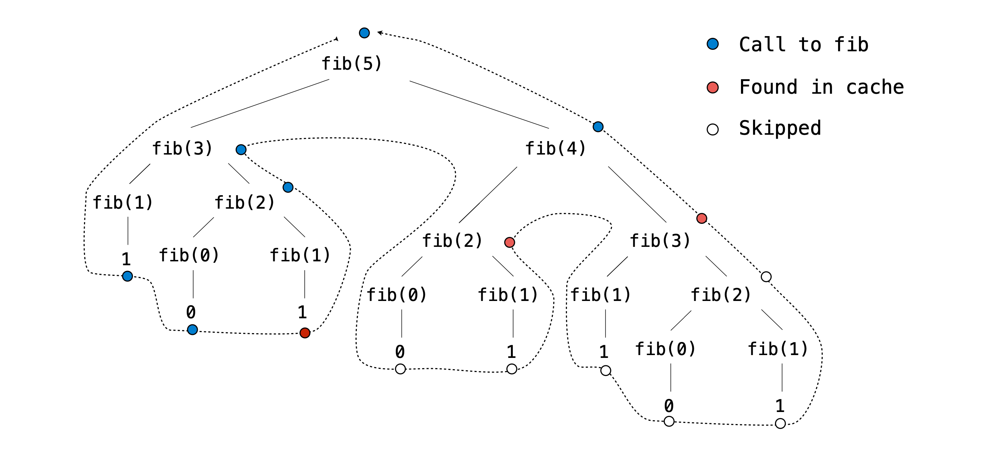

# Computer Aided Typing Software 


## Introduction

In this project, you will write a program that measures typing speed. Additionally, you will implement typing autocorrect, which is a feature that attempts to correct the spelling of a word after a user types it. 


## Starter Files

This project includes several files, _but your changes will be made only to_ `cats.py`. Here are the files included in the archive:

- `cats.py`: The typing test logic.
- `utils.py`: Utility functions for interacting with files and strings.
- `ucb.py`: Utility functions for CS 61A projects.
- `data/sample_paragraphs.txt`: Text samples to be typed. These are scraped Wikipedia articles about various subjects.
- `data/common_words.txt`: Common English words in order of frequency.
- `data/words.txt`: Many more English words in order of frequency.
- `data/final_diff_words.txt`: Even more English words!
- `data/testcases.out`: Test cases for the optional Final Diff extension.
- `cats_gui.py`: A web server for the web-based graphical user interface (GUI).
- `gui_files`: A directory of files needed for the graphical user interface (GUI).
- `multiplayer`: A directory of files needed to support multiplayer mode.
- `favicons`: A directory of icons.
- `images`: A directory of images.
- `ok`, `cats.ok`, `tests`: Testing files.
- `score.py`: Part of the optional Final Diff extension.

## Logistics

The project is worth 20 points. 19 points are for correctness and 1 point is for submitting Phases 1 & 2 by the checkpoint date.

You will turn in the following files:

- `cats.py`


For the functions that we ask you to complete, there may be some initial code that we provide. If you would rather not use that code, feel free to delete it and start from scratch. You may also add new function definitions as you see fit.

**However, please do not modify any other functions or edit any files not listed above**. Doing so may result in your code failing our autograder tests. Also, please do not change any function signatures (names, argument order, or number of arguments).

Throughout this project, you should be testing the correctness of your code. It is good practice to test often, so that it is easy to isolate any problems. However, you should not be testing _too_ often, to allow yourself time to think through problems.

We have provided an **autograder** called `ok` to help you with testing your code and tracking your progress. The first time you run the autograder, you will be asked to **log in with your Ok account using your web browser**. Please do so. Each time you run `ok`, it will back up your work and progress on our servers.

The primary purpose of `ok` is to test your implementations.

If you want to test your code interactively, you can run

```
 python3 ok -q [question number] -i  --local
```

with the appropriate question number (e.g. `01`) inserted. This will run the tests for that question until the first one you failed, then give you a chance to test the functions you wrote interactively.

You can also use the debugging print feature in OK by writing

```
 print("DEBUG:", x) 
```

which will produce an output in your terminal without causing OK tests to fail with extra output.

# Phase 1: Typing

> **Reminder**: Throughout the project, we will only be making changes to functions in `cats.py`.

### Problem 1 (1 pt)

Implement `pick`. This function selects which paragraph the user will type for the typing test. It takes three parameters:

- `paragraphs`: a list of potential paragraphs (strings)
- `select`: a function that evaluates a paragraph and returns `True` if it meets certain criteria, and `False` otherwise
- `k`: a non-negative integer representing the index of the desired paragraph among those that meet the criteria

The `pick` function returns the `k`th paragraph that satisfies the `select` function. If no such paragraph exists (because `k` is greater than or equal to the number of qualifying paragraphs), then `pick` returns an empty string.

> **Hint**: Don't worry about the specific implementation of the `select` function. Just assume it takes a paragraph as input and returns `True` or`False`. **Reminder**: Indexing starts at 0. If `k` is 0, we want to pick the _first_ qualifying paragraph.

Before writing any code, unlock the tests to verify your understanding of the question:
```
python3 ok -q 01 -u --local
```

Once you are done unlocking, begin implementing your solution. You can check your correctness with:
```
python3 ok -q 01 --local
```
### Problem 2 (1 pt)

Implement the `about` function, which takes a list of `subject` words. It returns a function that, when given a paragraph, checks whether the paragraph contains any of the words from the subject list. The returned function will return `True` if any of the words in the subject list are found in the paragraph and `False` otherwise.

Once `about` is implemented, we can use the function it returns as the `select` argument in `pick`. This is useful because it allows us to filter paragraphs based on whether they contain any words from the subject list provided to the `about` function. This functionality will be useful as we continue to develop our typing test.

To ensure accurate comparisons, you will need to:

1. Ignore case (treat uppercase and lowercase letters as equivalent).
2. Ignore punctuation in the paragraph.
3. Only check for exact matches of the words in the `subject` list, not substrings. For example, instances of "dogs" in `paragraph` should not match "dog" in `subject`.

> **Hint**: Use the `split`, `lower`, and `remove_punctuation` functions in `utils.py`.

Before writing any code, unlock the tests to verify your understanding of the question:

```
python3 ok -q 02 -u --local
```

Once you are done unlocking, begin implementing your solution. You can check your correctness with:
```
python3 ok -q 02 --local
```


### Problem 3 (2 pts)

Implement `accuracy`, which takes both a `typed` paragraph and a `source` paragraph. It returns the percentage of words in `typed` that exactly match the corresponding words in `source`. Case and punctuation must match as well. "Corresponding" here means that two words must occur at the same indices in `typed` and `source`; the first words of both must match, the second words of both must match, and so on.

A _word_ in this context is any sequence of characters separated from other words by whitespace. Therefore, treat sequences like "dog;" as a single word.

If `typed` is longer than `source`, then the extra words in `typed` that have no corresponding word in `source` are all _incorrect_.

If both `typed` and `source` are empty, then the accuracy is 100.0. If `typed` is empty but `source` is not empty, then the accuracy is zero. If `typed` is not empty but `source` is empty, then the accuracy is zero.

In the actual typing test, `typed` represents what the player has typed, and `source` is the paragraph they are attempting to replicate.

Before writing any code, unlock the tests to verify your understanding of the question:

```
python3 ok -q 03 -u --local
```

  
Once you are done unlocking, begin implementing your solution. You can check your correctness with:

```
python3 ok -q 03 --local
```


### Problem 4 (1 pt)

Implement `wpm`, which computes the _words per minute_, a measure of typing speed, given a string `typed` and the amount of `elapsed` time in **seconds.** Despite its name, _words per minute_ is not based on the number of words typed, but instead the number of groups of 5 characters, so that a typing test is not biased by the length of words. The formula for _words per minute_ is the ratio of the number of characters (including spaces) typed divided by 5 (a typical word length) to the elapsed time in **minutes.**

For example, the string `"I am glad!"` contains ten characters (not including the quotation marks). The words per minute calculation uses 2 as the number of words typed (because 10 / 5 = 2). If someone typed this string in 30 seconds (half a minute), their speed would be 4 words per minute.

Before writing any code, unlock the tests to verify your understanding of the question:

```
python3 ok -q 04 -u --local
```

  
Once you are done unlocking, begin implementing your solution. You can check your correctness with:

```
python3 ok -q 04 --local
```


**Time to test your typing speed!** You can use the command line to test your typing speed on paragraphs about a particular subject. For example, the command below will load paragraphs about cats or kittens. See the `run_typing_test` function for the implementation if you're curious (but it is defined for you).

```
python3 cats.py -t cats kittens
```

You can also try out the web-based graphical user interface (GUI) using the following command. (You may have to use `Ctrl+C` or `Cmd+C` on your terminal to quit the GUI after you close the tab in your browser).

```
python3 cats_gui.py
```

# Phase 2: Autocorrect

In the web-based GUI, there is an "Enable Auto-Correct" option, but right now it doesn't do anything. Let's implement automatic typo correction. Whenever the user presses the space bar, if the last word they typed doesn't match a word in the dictionary but is close to one, then that similar word will be substituted for what they typed.

### Problem 5 (2 pts)

Implement `autocorrect`, which takes a `typed_word`, a `word_list`, a `diff_function`, and a `limit`. The goal of `autocorrect` is to return the word in `word_list` that is closest to the provided `typed_word`, as determined by `diff_function`.

Specifically, `autocorrect` does the following:

- If the `typed_word` is contained inside the `word_list`, `autocorrect` returns that word.
- Otherwise, `autocorrect` returns the word from `word_list` that has the lowest difference from the provided `typed_word`. This difference is the number returned by the `diff_function`.
- However, if the lowest difference between `typed_word` and any of the words in `word_list` is greater than `limit`, then `typed_word` is returned instead. In other words, `limit` sets a maximum threshold on how severe a typo can be for it to still be corrected.

Assume that `typed_word` and all elements of `word_list` are lowercase and have no punctuation.

> **Important**: If multiple strings in `word_list` are tied for the lowest difference from `typed_word`, `autocorrect` should return the string that appears earliest (with the smallest index) in `word_list`.

A diff function takes in three arguments. The first is the `typed_word`, the second is the source word (in this case, a word from `word_list`), and the third argument is the `limit`. The output of the diff function, which is a number, represents the amount of difference between the two strings.

Here is an example of a diff function that computes the minimum of `1 + limit` and the difference in length between the two input strings:

```
>>> def length_diff(w1, w2, limit):
...     return min(limit + 1, abs(len(w2) - len(w1)))
>>> length_diff('mellow', 'cello', 10)
1
>>> length_diff('hippo', 'hippopotamus', 5)
6
```

> **Note**: For conciseness, some unlocking tests use a ternary operator when defining a lambda function. A ternary operator is the one-line version of an `if` statement.
> 
> For example, in one of the ok tests, we define a diff function as `first_diff = lambda w1, w2, limit: 1 if w1[0] != w2[0] else 0`. Here, lambda function returns 1 if the first characters of `w1` and `w2` are different, otherwise it returns 0.

Here is a helpful hint for implementing `autocorrect`:

> **Hint**: Try using `max` or `min` with the optional `key` argument (which takes in a one-argument function). For example, `max([-7, 2, -1], key=abs)` would return `-7` since `abs(-7)` is greater than `abs(2)` and `abs(-1)`.

Before writing any code, unlock the tests to verify your understanding of the question:

```
python3 ok -q 05 -u --local
```


Once you are done unlocking, begin implementing your solution. You can check your correctness with:

```
python3 ok -q 05 --local
```

### Problem 6 (3 pts)
Implement `furry_fixes`, a diff function that could be passed into the `diff_function` parameter in `autocorrect`. This function takes in two strings and returns the minimum number of characters that must be changed in the `typed` word in order to transform it into the `source` word. If the strings are not of equal length, the difference in lengths is added to the total difference count.
Here are some examples:

```
>>> big_limit = 10
>>> furry_fixes("nice", "rice", big_limit)    # Substitute: n -> r
1
>>> furry_fixes("range", "rungs", big_limit)  # Substitute: a -> u, e -> s
2
>>> furry_fixes("pill", "pillage", big_limit) # Don't substitute anything, length difference of 3.
3
>>> furry_fixes("goodbye", "good", big_limit) # Don't substitute anything, length difference of 3.
3
>>> furry_fixes("roses", "arose", big_limit)  # Substitute: r -> a, o -> r, s -> o, e -> s, s -> e
5
>>> furry_fixes("rose", "hello", big_limit)   # Substitute: r->h, o->e, s->l, e->l, length difference of 1.
5
```

> **Important**: You may not use `while`, `for`, or list comprehensions in your implementation. Use recursion.

If the number of characters that must change is greater than `limit`, then `furry_fixes` should return any number larger than `limit` and should minimize the amount of computation needed to do so.

> Why is there a limit? From Problem 5, we know that `autocorrect` will reject any `source` word whose difference with the `typed` word is greater than `limit`. It doesn't matter if the difference is greater than `limit` by 1 or by 100; autocorrect will reject it just the same. Therefore, as soon as we know the difference is above `limit`, it makes sense to stop making recursive calls, saving time, even if the returned difference won't be exactly correct.
> 
> These two calls to `furry_fixes` should take about the same amount of time to evaluate:
> 
> ```
> >>> limit = 4
> >>> furry_fixes("roses", "arose", limit) > limit
> True
> >>> furry_fixes("rosesabcdefghijklm", "arosenopqrstuvwxyz", limit) > limit
> True
> ```

To ensure that you are correctly saving time by stopping the recursion after `limit` is reached, there is an autograder test that measures the performance of your solution based on the number of function calls that it makes. If you fail this test, consider adding a base case related to the `limit`.

> **Hint**: you will need more than one base case to solve this problem.

String Slicing:
> 
A string is a sequence of characters. (Letters, digits, and punctuation are all characters.) A slice of a string is another string that contains some of the characters of the original. Here are some examples:
>```
>>> a = 'strap'
>>> a[0]
's'
>>> a[1:]
'trap'
>>> a[2:]
'rap'
>>> a[1:][1:]
'rap'


Before writing any code, unlock the tests to verify your understanding of the question:
```
python3 ok -q 06 -u --local
```

Once you are done unlocking, begin implementing your solution. You can check your correctness with:
```
python3 ok -q 06 --local
```
Try enabling auto-correct in the GUI. Does it help you type faster? Are the corrections accurate?
### Problem 7 (3 pts)
Implement `minimum_mewtations`, a more advanced diff function that can be used in `autocorrect`, which returns the _minimum_ number of edit operations needed to transform the `typed` word into the `source` word.

There are three kinds of edit operations, with some examples:
1. Add a letter to `typed`.
    - Adding `"k"` to `"itten"` gives us `"kitten"`.
2. Remove a letter from `typed`.
    - Removing `"s"` from `"scat"` givs us `"cat"`.
3. Substitute a letter in `typed` for another.
    - Substituting `"z"` with `"j"` in `"zaguar"` gives us `"jaguar"`.
Each edit operation contributes 1 to the difference between two words.

```
>>> big_limit = 10
>>> minimum_mewtations("cats", "scat", big_limit)       # cats -> scats -> scat
2
>>> minimum_mewtations("purng", "purring", big_limit)   # purng -> purrng -> purring
2
>>> minimum_mewtations("ckiteus", "kittens", big_limit) # ckiteus -> kiteus -> kitteus -> kittens
3
```

We have provided a template of an implementation in `cats.py`. You may modify the template however you want or delete it entirely.

> **Hint:** One of the recursive calls in `minimum_mewtations` will be similar to `furry_fixes`. However, because `minimum_mewtations` considers _specific_ types of edits (add, remove, substitute), there will need to be additional recursive calls to handle each of these cases.

If the number of edits required is greater than `limit`, then `minimum_mewtations` should return **any number** larger than `limit` (such as `limit + 1`) and should stop making recursive calls once the limit is reached to save time.

> These two calls to `minimum_mewtations` should take about the same amount of time to evaluate:
> 
> ```
> >>> limit = 2
> >>> minimum_mewtations("ckiteus", "kittens", limit) > limit
> True
> >>> minimum_mewtations("ckiteusabcdefghijklm", "kittensnopqrstuvwxyz", limit) > limit
> True
> ```

To ensure that your code stops making recursive calls after the `limit` is reached, there is an autograder test that measures the performance of your solution based on the number of function calls that it makes.

> **Important**: You _should not_ use any helper functions in your implementation of `minimum_mewtations`. Otherwise the autograder test might fail.
> 
> **Important**: Rememebr to remove the following line of code when you are ready to test your implementation:
> 
> ```
> assert False, 'Remove this line'
> ```

Before writing any code, unlock the tests to verify your understanding of the question:

```
python3 ok -q 07 -u --local
```
Once you are done unlocking, begin implementing your solution. You can check your correctness with:
```
python3 ok -q 07 --local
```
Try enabling auto-correct and typing again. Are the corrections more accurate?

```
python3 cats_gui.py
```

### (Optional) Extension: Final Diff (0 pts)
You may optionally design your own diff function called `final_diff`. Here are some ideas for making even more accurate corrections:
- Take into account which additions and deletions are more likely than others. For example, it's much more likely that you'll accidentally leave out a letter if it appears twice in a row.
- Treat two adjacent letters that have swapped positions as one change, not two.
- Try to incorporate common misspellings.
- Letters near to each other on the keyboard are more commonly substituted.
You can also set the limit you'd like your diff function to use by changing the value of the variable `FINAL_DIFF_LIMIT` in `cats.py`.
You can check your `final_diff`'s success rate on a provided dataset of common misspellings by running:

```
 python3 score.py
```

If you don't know where to start, try copy-pasting your code for `furry_fixes` and `minimum_mewtations` into `final_diff` and scoring them. Looking at the typos they fixed (and didn't fix) might give you some ideas!

# Checkpoint Submission

Check to make sure that you completed all the problems in Phase 1 and Phase 2:

```
python3 ok --score --local
```
Then, submit `cats.py` to the **Cats Checkpoint** assignment on **Gradescope** before the checkpoint deadline.

When you run `ok` commands, you'll still see that some tests are locked because you haven't completed the whole project yet. You'll get full credit for the checkpoint if you complete all the problems up to this point.

# Phase 3: Multiplayer

Typing is more fun with friends! You'll now implement multiplayer functionality, so that when you run `cats_gui.py` on your computer, it connects to the course server at [cats.cs61a.org](https://cats.cs61a.org/) and looks for someone else to race against.

To race against a friend, 5 different programs will be running:

- Your GUI, which is a program that handles all the text coloring and display in your web browser.
- Your `cats_gui.py`, which is a web server that communicates with your GUI using the code you wrote in `cats.py`.
- Your opponent's `cats_gui.py`.
- Your opponent's GUI.
- The CS 61A multiplayer server, which matches players together and passes messages around.

When you type, your GUI uploads what you have typed to your `cats_gui.py` server, which computes how much progress you have made and returns a progress update. This server also uploads a progress update to the CS 61A multiplayer server, so that your opponent's GUI can also display your progress.

Meanwhile, your GUI display constantly tries to stay current by requesting your opponent's progress updates from `cats_gui.py`, which, in turn, retrieves that information from the multiplayer server.

Each player has an `id` number that is used by the server to track typing progress.

### Problem 8 (2 pts)

Implement `report_progress`, which is called every time the user finishes typing a word. It takes a list of the words `typed`, a list of the words in the `source`, the user's `user_id`, and a `upload` function that is used to upload a progress report to the multiplayer server. There will never be more words in `typed` than in `source`.

Your progress is a ratio of the words in the `source` that you have typed correctly, up to the first incorrect word, divided by the number of `source` words. For example, this example has a progress of `0.25`:

```
report_progress(["Hello", "ths", "is"], ["Hello", "this", "is", "wrong"], ...)
```

Your `report_progress` function should do two things: upload a message to the multiplayer server and return the progress of the player with `user_id`.

To upload a message to the multiplayer server, call the `upload` function on a two-item dictionary containing the keys `'id'` and `'progress'`. The function should then return the player's progress, which is the ratio of words you computed.

> **Hint:** See the dictionary below for an example of a potential input to the `upload` function. This dictionary represents a player with `user_id` 4 and `progress` 0.6.
> 
> `{'id': 4, 'progress': 0.6}`

Before writing any code, unlock the tests to verify your understanding of the question:

```
python3 ok -q 08 -u --local
```

  

Once you are done unlocking, begin implementing your solution. You can check your correctness with:

```
python3 ok -q 08 --local
```

  

### Problem 9 (1 pt)

Implement `time_per_word`, which takes in two arguments:

1. `words`: a list of words that players are typing.
2. `timestamps_per_player`: a list of lists where each inner list contains the timestamps indicating when each player finished typing each word in `words`.

The function should return two values:

- The list of words that the players are typing.
- A list of lists `times` that stores the durations it took each player to type each word. Specifically, the value at `times[i][j]`should indicate how long it took player `i` to type the word at `words[j]`.

Timestamps found in the parameter `timestamps_per_player` are cumulative and always increasing, while the values in `times` are **differences between consecutive timestamps for each player**.

Here's an example: If `timestamps_per_player = [[1, 3, 5], [2, 5, 6]]`, then `times` would be `[[2, 2], [3, 1]]`.

This is because the first player finished typing each word at timestamps `1`, `3`, and `5`, while the second player finished typing each word attimestamps `2`, `5`, and `6`. So the differences in timestamps are `(3-1)`, `(5-3)` for the first player and `(5-2)`, `(6-5)` for the second player. The first value of each list within `timestamps_per_player` represents the initial starting time for each player.

Before writing any code, unlock the tests to verify your understanding of the question:

```
python3 ok -q 09 -u --local
```


Once you are done unlocking, begin implementing your solution. You can check your correctness with:

```
python3 ok -q 09 --local
```

### Problem 10 (3 pts)

Implement `fastest_words`, which returns which words each player typed fastest. This function is called once all players have finished typing. It takes in a dictionary returned by `time_per_word`.

The `fastest_words` function returns a list of lists of words, one list for each player. The list for each player contains the words they typed faster than all the other players. In the case of a tie, the player with the smallest index is considered to be the one who typed it the fastest.

For example, consider two players who typed `Just have fun`. Player 0 typed `'fun'` the fastest (3 seconds), Player 1 typed `'Just'` the fastest (4 seconds), and they tied on the word `'have'` (both took 1 second). In this case, Player 0 is considered the fastest for `'have'` because their index is smaller.

```
>>> player_0 = [5, 1, 3]
>>> player_1 = [4, 1, 6]
>>> fastest_words({'words': ['Just', 'have', 'fun'], 'times': [player_0, player_1]})
[['have', 'fun'], ['Just']]
```

Use the helper function `get_time` (provided) to get an individual time from `times`. It provides helpful error messages when you try to access a time that doesn't exist.

```
def get_time(times, player_num, word_index):
    """Return the time it took player_num to type the word at word_index,
    given a list of lists of times returned by time_per_word."""
```

> **Important**: Make sure your implementation does not mutate the given player input lists. For the example above, calling `fastest_words` on `[player_0, player_1]` should **not** mutate `player_0` or `player_1`.
> 
> There might not always be two players, so generalize this function in a way that will allow it to handle an indeterminate number of players.

Before writing any code, unlock the tests to verify your understanding of the question:

```
python3 ok -q 10 -u --local
```

  

Once you are done unlocking, begin implementing your solution. You can check your correctness with:

```
python3 ok -q 10 --local
```
  
Congratulations! Now you can play against other students in the course. Set `enable_multiplayer` to `True` near the bottom of `cats.py` and type swiftly!

```
python3 cats_gui.py
```

# Project Submission

Run `ok` on all problems to make sure all tests are unlocked and pass:

```
python3 ok --local
```

You can also check your score on each part of the project:

```
python3 ok --score --local
```

# Phase 4: Efficiency (Extra Challenge)

### (Optional) Problem EC (0 pt)

> **Note**: This problem is **optional** and **will not worth any points**. It is meant to be a extra challenge for those who are interested in improving the efficiency of their code. **Only attempt this problem if you have completed all other problems in the project.**

> During Office Hours and Project Parties, the staff will prioritize helping students with required questions. We will not be offering help with this question unless the [queue](https://oh.cs61a.org/) is empty. In this problem, you will implement memoization decorators that will increase the efficiency of our our program by "remembering" the results of particularly intensive operations.

Make sure you're familiar with the decorators and memoization. If you would like a refresher, open the dropdown boxes below for more information.

A Python decorator allows you to modify a pre-existing function without changing the function's structure.

Specifically, a decorator function is a higher-order function that...

- Takes the original function as an input
- Returns a new function with modified functionality
- This new function **must** contain the same arguments as the original function

An example of a decorator that executes a one-input function twice is shown below:

```
>>> def do_twice(original_function):
...     def repeat(x):
...             original_function(x)
...             original_function(x)
...     return repeat
```

We can apply this function in multiple contexts:

```
# Printing a value twice
>>> @do_twice
... def print_value(x):
...     print(x)
...
>>> print_value(5)
5
5
# Adding an item to a list twice
>>> lst = []
>>> @do_twice
... def add_to_list(item):
...     lst.append(item)
...
>>> add_to_list(5)
>>> lst
[5, 5]
```

Additionally, note that we could also directly call the decorator function instead of using the `@` notation (i.e. `print_value = do_twice(print_value)`). However, it's typically useful to place decorators directly above the function that we are modifying since they better describe how these functions are being changed in our code.

Notice that the diff functions we wrote in the previous questions are very inefficient: you will likely find that the computer will make the same recursive call multiple times. For a function with multiple arguments and three recursive calls, this can be harder to see. It can be easier to first see this with a function like `fib` that is defined in lecture.



Noticed how many redundant recursive calls there are in the above tree diagram. Our goal is to have our program store past results of evaluated recursive calls so that we can reuse them if the same recursive call comes up in the future. For example, the first branch of `fib(5)` calls `fib(3)`, which has not yet been evaluated. So we must go through all of its subsequent recursive calls to find its return value. However when we encounter the call to `fib(3)` that is a branch of `fib(4)`, we have already found its return value before! So if we have a way to store and retrieve that information in something called a cache, we can avoid needless computation. We no longer need to make any subsequent recursive calls to its branches `fib(1)` and `fib(2)`. This is the concept of **memoization**: store the results of expensive computations in a cache, and retrieve information from the cache in the case we execute a repeated action.

We will be working with two memoization decorators. `memo` is a general all-purpose decorator that memoizes the function it annotates. If `memo` encounters an input it has not seen, it will store the calculated result into its `cache`. If `memo` receives an input it has already seen, it will take the stored value in the `cache` and returns it directly without doing any extra computation. We have provided you with the full implementation of `memo`.

Your task is to implement `memo_diff`. `memo_diff` is a higher-order function that takes in a `diff_function` and returns another diff function called `memoized` that, like all diff functions, takes in `typed`, `source`, and `limit`. `memoized` should do the following:

- When `memoized` sees a (`typed`, `source`) pair for the first time, it should calculate the difference using `diff_function` and cache that value along with the `limit` used as a (`value`, `limit`) tuple pair.
- If `memoized` encounters the (`typed`, `source`) pair again, it should return the memoized `value` if the provided `limit` is less than or equal to the cached limit. Otherwise, the difference should be recalculated, recached, and returned.

> **Important:** When implementing this function, make sure you store pairs of values in the cache with a tuple, **not** a list. In dictionaries, keys must be _immutable_ (that's why using a tuple is fine, but using a list is not). If you're curious about why `memo_diff` is different than `memo` and is implemented in this way, reference the dropdown below:

How do `memo` and `memo_diff` differ? Although `memo` stores only the result of a function call, `memo_diff` takes into account an additional constraint, `limit`, that affects whether the cached result can be used or not. When the `memo_diff` function is called with a (`typed`, `source`) pair, it doesn’t just check if the pair has been seen before; it also checks if the `limit` is less than or equal to the cached `limit`. This is an additional check that `memo` does not perform.

Why is `limit` handled this way? We already know that the `limit` represents the maximum difference that a diff function cares about—that is, differences above the `limit` might as well be the same. So diff functions will provide an accurate difference value when it is below the limit and an inaccurate one when it is above the limit. Therefore, we can trust a cached difference value if it was calculated with a higher limit, but we can't trust ones calculated with a lower limit.

For example, the result of the first call below would allow us to predict the result of the second call. The higher limit provides us with more information. However, the second call would not allow us to predict the first one.

```
>>> minimum_mewtations("hello", "hasldfasdfsffsfasdf", 100)
17
>>> minimum_mewtations("hello", "hasldfasdfsffsfasdf", 2)
3
```

  
Once you've implemented `memo_diff`, finish by:

1. Decorating `autocorrect` with `memo`.
2. Decorating `minimum_mewtations` with `memo_diff`.

Running `autocorrect` and `minimum_mewtations` should now be much faster!

> **Note**: If you are failing the autograder tests involving `call_count`, it is likely that your `minimum_mewtations` implementation (from Q7) is not having the _tightest base cases_ possible and still needs some optimization. The tests from Q7 are not meant to be strict, so even if you passed the Q7 tests, your base cases might still not be the tightest. Make sure you are not making unnecessary recursive calls. We are being strict about this here because having the tightest base cases is crucial for the efficiency of your code.
> 
> **Important**: Try it yourself first! Only consult the following common mistakes section if you have been stuck on one test case for a while. Otherwise, you might not learn as much from the project.

- Consider the case `minimum_mewtations(typed = "maooo", source = "mao", limit = 0)`: since no transformations are allowed and the two words are not the same, how quick can your function figure out that the result is impossible?
- Consider the case `minimum_mewtations(typed = "habc", source = "hmao", limit = some_limit_greater_than_zero)`: Given that both strings start with the same character `h`, what is the most effective approach in this situation? Should the function even attempt to "add" (resulting in `habc` and `mao`) or "remove" (resulting in `abc` and `hmao`)? Does your implementation take advantage of this optimization?

> Note: The autograder takes a bit of time to run, but it should not be longer than 10 seconds.

Before writing any code, unlock the tests to verify your understanding of the question:

```
python3 ok -q EC -u --local
```


Once you are done unlocking, begin implementing your solution. You can check your correctness with:

```
python3 ok -q EC --local
```